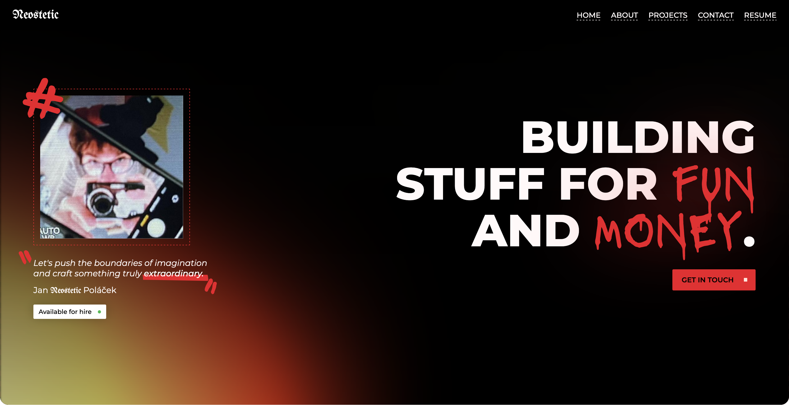

### neostetic.github.io

#### Information
 - **Name:** neostetic.github.io
 - **Version:** 5.0.6-bugfix
 - **Website:** https://neostetic.github.io
#### Download Content
 - **License:** [LICENSE](./LICENSE) ([download](https://github.com/neostetic/template/raw/main/LICENSE))
#### Legal actions
 - Please, before using or cloning this project, read our [License Terms](./LICENSE).
 - **By cloning, you are agreeing to the license and its intent.**

##### Copyright © 2026 Jan Poláček (neostetic). All rights reserved.
